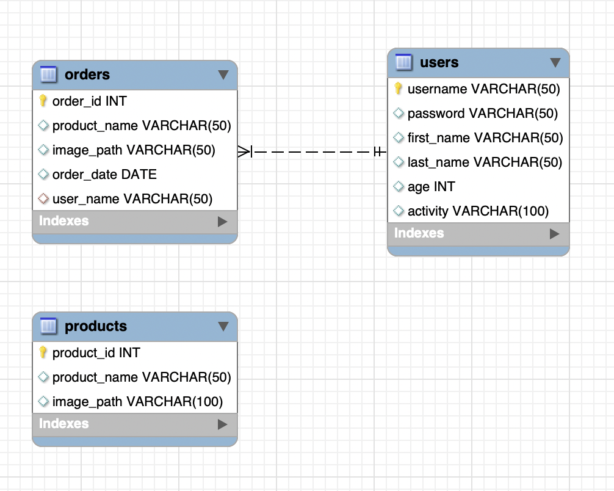
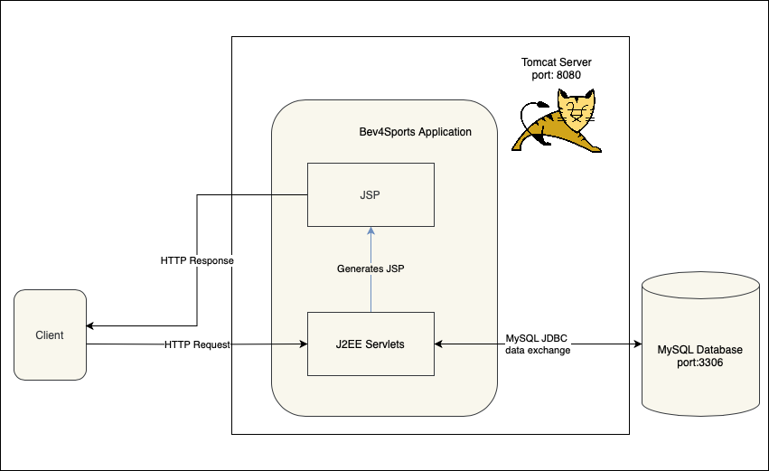
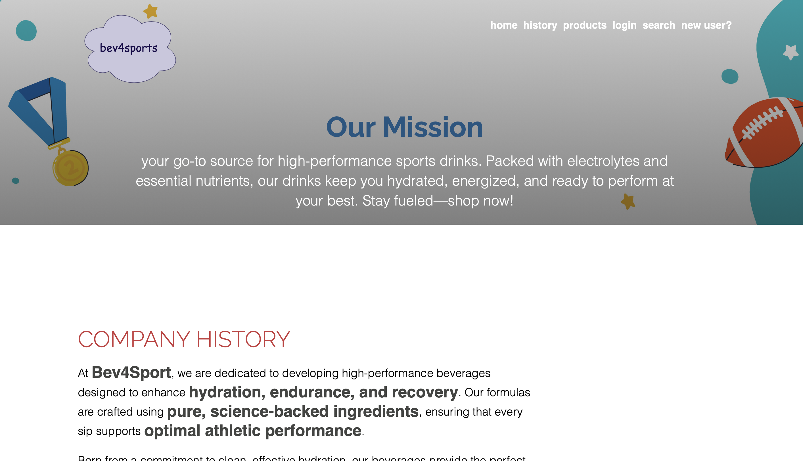

# Bev For Sports

* [Introduction](#Introduction)
* [Quick Start](#Quick-Start)
* [Design](#Design)
* [J2EE Servlets](#J2EE-Servlets)
* [Demo](#Demo)
* [Deployment](#Deployment)

## Introduction

<a id=Introduction ></a>

Even though modern Java web development often uses frameworks like Spring Boot, learning JSP (JavaServer Pages) and Servlets is still valuable for several reasons—especially if you're aiming to be a solid, well-rounded Java developer. Spring, Struts, and other frameworks often abstract away JSP/Servlet logic, but they’re built on top of it. When something breaks or requires customization, this knowledge becomes very useful. Also, understanding how they work gives you insight into how higher-level frameworks (like Spring MVC) function under the hood. Lastly, many older enterprise systems still run on JSPs and Servlets. Having a solid understanding of them is helpful when maintaining or migrating legacy applications.

This application is an e-commerce website that sells sports beverages. It is built using JSP, J2EE Servlets, and a MySQL database. A user of this website/application can register to become a member, purchase sports beverage products, and review previously ordered items.

## Quick Start

There is two ways to quickly start the application. 

1. <b>Hosting on a server</b>
    First, install and run mysql server. Then, login to the MySQL server
    ```bash
    mysql -u <username> -p -h <hostname> -P <port>
    ```
    Then, run `mysql/bev4sports.sql` for schema set up
    ```sql
    mysql> source ./mysql/bev4sports.sql;
    ```
    Or you can do all above using `MySQLWorkbench` application.
    \
    Download a tomcat server close to tomcat-9.0.89 (9.0.89 was the server version used to develop the application) - [Tomcat 9.0.89 Link](https://repo1.maven.org/maven2/org/apache/tomcat/tomcat/9.0.89/). 
    \
    Copy or Move the `bev-for-sports.war` to `webapps/` directory of the server, and run the standalone server by running following:
    ```bash
    <server directory>/bin/startup.sh
    ```
    to shutdown after use run following:
    ```bash
    <server directory>/bin/shutdown.sh
    ```

2. <b>Run on docker</b>
    First pull the mysql and the application images from dockerhub
    ```bash
    docker pull johnphk/bev4sports-sql
    docker pull johnphk/bev-for-sports
    ```
    Create a Docker network so that the MySQL container and the application container can communicate with each other
    ```bash
    docker network create bev4sports-network
    ```
    Run the mysql container
    ```bash
    docker run --name bev4sports-sql -d -p 3306:3306 -e MYSQL_ROOT_PASSWORD=password --net bev4sports-network johnphk/bev4sports-sql --default-authentication-plugin=caching_sha2_password 
    ```
    Run the application container
    ```bash
    docker run -d --net bev4sports-network -p 8080:8080 johnphk/bev-for-sports
    ```
For all cases, the application should run on `localhost:8080`.

## Design

<b>Database Design</b>




- `products` 
    - This is a table containing data about each product we are selling. 
    - `product_id` is the primary key of this table.
- `orders` 
    - This is a table containing order(s) made by a user in `user_name` of the table. 
    - `order_id` is the primary key of this table.
    - The column `user_name` refers to the `user_name` of users table.
- `users` 
    - This is a table containing user information.
    - `username` is the primary key of this table.


<b>Application Design</b>



- The left part of the diagram shows a client, the middle portion shows a tomcat server hosting an
- The client will communicate with the J2EE Servlets through the Tomcat server's URL and the route defined for each servlet.
- Once a JSP receives a request—whether `GET`, `POST`, `PUT`, `PATCH`, or `DELETE`—it will process the request and retrieve or update the relevant data in the MySQL database.
- The application will then generate an HTTP response using JSP and return <b>dynamic</b> content to the client.

## J2EE Servlets
<p><b>HomeServlet</b> – Responsible for handling HTTP GET requests to the application's home page. It initializes a database connection during the servlet's lifecycle (<code>init</code> method), forwards requests to the <code>index.html</code> page, and ensures proper cleanup by closing the database connection in the <code>destroy</code> method.</p>

<p><b>LoginServlet</b> – Handles user login functionality. It processes GET requests by forwarding users to the login page (<code>login.jsp</code>) and POST requests by validating user credentials through the <code>ApplicationDao</code>. If the credentials are valid, it sets up an HTTP session and forwards the user to the home page; otherwise, it displays an error message on the login page.</p>

<p><b>LogoutServlet</b> – Handles user logout functionality by invalidating the current HTTP session to clear user data. After logging out, it forwards the user to the application's home page (<code>index.html</code>).</p>

<p><b>OrderHistory</b> – Retrieves the order history for a logged-in user by fetching the username from the session and querying the database through the <code>ApplicationDao</code>. It sets the retrieved order data as a request attribute and forwards the user to the <code>home.jsp</code> page to display the order history.</p>

<p><b>ProductsServlet</b> – Manages the user's shopping cart by adding selected products to the cart stored in the session. It also retrieves product search results from the database using the <code>ApplicationDao</code> and forwards the results to the <code>searchResults.jsp</code> page for display.</p>

<p><b>RegisterUserServlet</b> – Handles user registration by collecting form data, populating a <code>User</code> object, and saving it to the database using the <code>ApplicationDao</code>. It provides feedback to the user about the success or failure of the registration and dynamically updates the <code>register.html</code> page with the appropriate message.</p>

<p><b>SearchServlet</b> – Handles product search functionality by retrieving the search query from the user, querying the database through the <code>ApplicationDao</code>, and fetching matching products. It stores the search query in the session, sets the search results as a request attribute, and forwards the user to the <code>searchResults.jsp</code> page to display the results.</p>

<p><b>ViewProfileServlet</b> – Retrieves the profile details of a logged-in user by fetching their username from the session and querying the database through the <code>ApplicationDao</code>. It also prepares additional data, such as a weight summary, sets these as request attributes, and forwards the user to the <code>profile.jsp</code> page to display the profile information.</p>


## Demo




## Deployments
The mysql image was built upon `mysql:8.0`. 